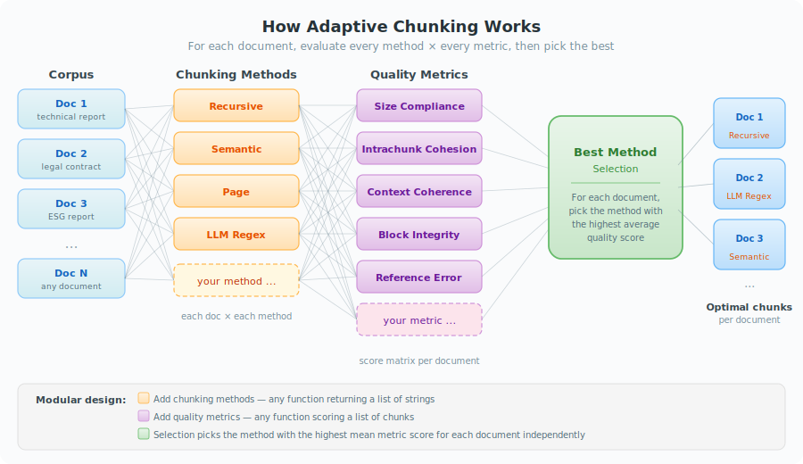

<div align="center">

# Adaptive Chunking

**Selecting the Best Chunking Strategy per Document for RAG**

[](https://arxiv.org/abs/2603.25333)
[](https://lrec2026.info/)
[](LICENSE)
[](https://www.python.org/downloads/)
<!-- [](https://pypi.org/project/adaptive-chunking/) -->

<!--  -->



</div>

---

> **Official implementation** of *"Adaptive Chunking: Optimizing Chunking-Method Selection for RAG"*, accepted at **[LREC 2026](https://lrec2026.info/)**.
>
> **Authors:** Paulo Roberto de Moura Junior, Jean Lelong, Annabelle Blangero — [Ekimetrics](https://www.ekimetrics.com/)

## What is Adaptive Chunking?

No single chunking method works best for every document in a RAG pipeline. **Adaptive Chunking** solves this by evaluating multiple chunking strategies against a set of intrinsic quality metrics and automatically selecting the best one for each document. Both dimensions are modular: you can plug in your own chunking methods and define your own evaluation metrics, making the framework easy to extend to new domains and use cases.

## Key Results

Adaptive Chunking selects the best splitting strategy per document using five intrinsic quality metrics, evaluated on 33 documents across 3 domains (~1.18M tokens).

**RAG evaluation** (Table 5 — Wilcoxon p < 0.05 for Retrieval Completeness):

| Metric | Adaptive Chunking | LangChain recursive | Page splitting |
|--------|---:|---:|---:|
| Retrieval Completeness | **67.7** | 58.1 | 59.1 |
| Answer Correctness | **78.0** | 70.1 | 73.3 |
| Answered queries | **65/99** | 49/99 | 49/99 |

**Intrinsic metrics** (Table 3 — mean % across all domains, Wilcoxon p < 0.001 vs all methods):

| Method | RC | ICC | DCC | BI | SC | **Mean** |
|--------|---:|----:|----:|---:|---:|--------:|
| **Adaptive Chunking** | 99.0 | 68.2 | 88.8 | 99.4 | 99.9 | **91.07** |
| LLM regex (GPT) | 98.0 | 70.9 | 82.4 | 98.1 | 99.6 | 89.80 |
| LangChain recursive | 96.1 | 65.6 | 88.8 | 95.0 | 97.7 | 88.62 |
| Semantic | 97.5 | 69.3 | 76.3 | 91.3 | 48.1 | 76.49 |
| Sentence | 86.3 | 78.4 | 72.5 | 61.9 | 67.2 | 73.26 |

## Evaluation Metrics

Five intrinsic metrics score each chunking output without requiring ground-truth answers:

| Metric | What it measures |
|--------|-----------------|
| **Size Compliance (SC)** | Fraction of chunks within target token-count bounds |
| **Intrachunk Cohesion (ICC)** | Semantic similarity between a chunk's sentences and its overall embedding |
| **Contextual Coherence (DCC)** | Similarity of each chunk to its surrounding context window |
| **Block Integrity (BI)** | Proportion of structural blocks (paragraphs, tables, lists) kept intact |
| **Filtered Missing Reference Error (RC)** | Coreference chains (entity–pronoun pairs) not broken across chunk boundaries |

All metrics are implemented in [`metrics.py`](src/adaptive_chunking/metrics.py) and can be extended with custom scoring functions.

## Default Chunking Methods

| Method | Description |
|--------|-------------|
| **Recursive (s=1100)** | Split-then-merge recursive splitter with a target chunk size of 1100 tokens |
| **Recursive (s=600)** | Same splitter with a smaller 600-token target, producing more granular chunks |
| **Page** | Splits on page breaks, with post-processing to enforce size constraints |
| **LLM Regex** | Asks an LLM to generate document-specific regex split patterns |

The recursive splitter lives in [`splitters.py`](src/adaptive_chunking/splitters.py); the others are in [`paper/splitters.py`](src/adaptive_chunking/paper/splitters.py). You can register any callable that takes text and returns a list of chunks.

## Features

- **Adaptive recursive splitter** — configurable separators, merge modes, overlap, and automatic per-document strategy selection
- **5 intrinsic quality metrics** — size compliance, intrachunk cohesion, contextual coherence, block integrity, and filtered missing reference error
- **3 PDF parsing backends** — Docling (open-source, default), PyMuPDF (lightweight), Azure Document Intelligence (cloud), plus Excel support
- **RAG evaluation pipeline** — hybrid retrieval with custom retrieval completeness metric and answer correctness scoring
- **Multi-domain evaluation** — tested on technical, legal, and sustainability reporting documents

## Installation

```bash
git clone https://github.com/ekimetrics/adaptive-chunking.git
cd adaptive-chunking
pip install -e ".[dev]"
```

Or install only what you need:

```bash
# Core package (splitter + metrics)
pip install -e .

# With coreference resolution (CC BY-NC-SA 4.0 — non-commercial)
pip install -e ".[coref]"

# With PDF/Excel parsing backends
pip install -e ".[parsing]"

# Paper reproduction (all dependencies)
pip install -e ".[paper]"
```

Some metrics require spaCy models:

```bash
python -m spacy download en_core_web_sm
```

## Quick Start

```python
from adaptive_chunking import chunk_files

# Parse PDFs and chunk in one step (requires pip install -e ".[parsing]")
chunks = chunk_files("path/to/pdfs/", chunk_size=600, chunk_overlap=50)

# Each chunk is a dict with: doc_name, chunk_index, chunk_text, chunk_pages, titles_context, chunk_len
for chunk in chunks:
    print(chunk["doc_name"], chunk["chunk_index"], chunk["chunk_len"])
```

Works with a single file too:

```python
chunks = chunk_files("path/to/report.pdf")
```

Choose a different parser:

```python
from adaptive_chunking.parsing import PyMuPDFParser

chunks = chunk_files("path/to/pdfs/", parser=PyMuPDFParser())
```

<details>
<summary><b>Using the splitter and metrics separately</b></summary>

```python
from adaptive_chunking.splitters import RecursiveSplitter

splitter = RecursiveSplitter(
    chunk_size=600,
    chunk_overlap=50,
    separators=["\n\n", "\n", " ", ""],
    merging="small_only",
    min_chunk_tokens=100,
)

chunks = splitter.split_text(document_text)
```

```python
from adaptive_chunking.metrics import (
    compute_size_compliance,
    compute_intrachunk_cohesion,
    compute_block_integrity,
)

score = compute_size_compliance(chunks, min_tokens=100, max_tokens=1100)
cohesion = compute_intrachunk_cohesion(chunks, embedder)
integrity = compute_block_integrity(chunks, source_text, split_points)
```

</details>

## Reproducing Paper Results

The `data/clair/` directory contains 33 pre-parsed documents and pre-computed coreference mentions from the CLAIR corpus used in the paper:

```
data/clair/
├── adi_parsed/   # 33 parsed JSON documents
└── mentions/     # Pre-computed maverick-coref clusters (no GPU needed)
```

To replicate the chunking evaluation (Tables 1–3, Figure 1):

```bash
pip install -e ".[paper]"
python -m spacy download en_core_web_sm

# Full Table 3 reproduction (GPU recommended for chunking; mentions are pre-computed)
python -m adaptive_chunking.paper.replicate \
    --data-dir data/clair/ \
    --output-dir results/ \
    --steps chunking metrics raw_metrics analysis table3 \
    --device cuda:0
```

**Steps explained:**

| Step | What it does | Notes |
|------|-------------|-------|
| `chunking` | Split 33 docs × 8 methods + postprocessing | GPU needed for semantic chunker |
| `mentions` | Extract coreference mentions | Pre-computed in `data/clair/mentions/` — skip unless regenerating |
| `metrics` | Score post-processed chunks (Table 3 `*` rows) | ~9h local · ~30 min with `JINA_API_KEY` |
| `raw_metrics` | Score raw chunks for baseline methods (Table 3 `†` rows) | Same cost as `metrics` |
| `analysis` | Print Tables 1–2, Figure 1 | |
| `table3` | Print full Table 3 with locally-computed vs paper values | Requires both `metrics` + `raw_metrics` |
| `rag` | RAG evaluation (Tables 4–5) | Expensive: hundreds of OpenAI calls + GPU |

The `metrics` and `raw_metrics` steps are resumable — if interrupted, rerun the same command and already-computed documents are skipped.

To skip the LLM regex splitter (requires `OPENAI_API_KEY`) or the semantic chunker (requires GPU + flash-attention):

```bash
python -m adaptive_chunking.paper.replicate ... --steps chunking --skip-llm-regex --skip-semantic
```

The RAG evaluation (Tables 4–5) is optional and expensive (hundreds of OpenAI API calls + GPU for embeddings):

```bash
python -m adaptive_chunking.paper.replicate --data-dir data/clair/ --output-dir results/ --steps rag --device cuda:0
```

<details>
<summary><b>Package Structure</b></summary>

| Module | Description |
|--------|-------------|
| `adaptive_chunking.splitters` | `RecursiveSplitter` — adaptive recursive chunking with configurable separators, merge modes, and overlap |
| `adaptive_chunking.metrics` | Quality metrics: size compliance, intrachunk cohesion, contextual coherence, block integrity, missing reference error |
| `adaptive_chunking.parsing` | Document parsers: `DoclingParser` (default), `PyMuPDFParser` (lightweight), `AzureDIParser` (cloud), `ExcelParser` |
| `adaptive_chunking.postprocessing` | Gap detection/repair, page/title metadata, chunk location |
| `adaptive_chunking.compute_metrics` | Orchestrates metric computation across documents |
| `adaptive_chunking.split_documents` | Orchestrates chunking across documents in a directory |
| `adaptive_chunking.extract_mentions` | Coreference resolution for the missing reference error metric |
| `adaptive_chunking.paper.*` | Paper reproduction: baseline splitters, RAG evaluation, visualization, results analysis |

</details>

<details>
<summary><b>Environment Variables</b></summary>

For full functionality, create a `.env` file:

```bash
# Azure Document Intelligence (only for AzureDIParser)
ADI_ENDPOINT=...
ADI_KEY=...

# OpenAI (for LLM regex chunker and RAG evaluation)
OPENAI_API_KEY=...

# Jina AI (optional but recommended for the metrics steps)
# If set, uses the Jina REST API instead of loading jina-embeddings-v3 locally.
# ~30 min vs ~9 hours on RTX 4090. Get a key at https://jina.ai/
JINA_API_KEY=...
```

</details>

## Development

A [`REPLICATE_GUIDELINES.md`](REPLICATE_GUIDELINES.md) file documents the environment setup, stability constraints, key files, and detailed notes for reproducing paper results.

An [`LLM.md`](LLM.md) file provides project context for LLM-based coding assistants (architecture, key patterns, adding new components).

## Testing

```bash
pytest
```

## Citation

If you use this work, please cite our LREC 2026 paper:

```bibtex
@inproceedings{demoura2026adaptive,
    title={Adaptive Chunking: Optimizing Chunking-Method Selection for RAG},
    author={de Moura Junior, Paulo Roberto and Lelong, Jean and Blangero, Annabelle},
    booktitle={Proceedings of the 15th Language Resources and Evaluation Conference (LREC 2026)},
    year={2026},
    url={https://arxiv.org/abs/2603.25333},
}
```

## License

This project is licensed under the [MIT License](LICENSE).

Some **optional** extras carry different licenses:

- **`[coref]`** — `maverick-coref` is CC BY-NC-SA 4.0 (non-commercial, share-alike)
- **`[parsing]`** — `pymupdf4llm` is AGPL-3.0 or Artifex Commercial

These are not installed by default. See [NOTICE](NOTICE) and [SBOM](SBOM.md) for full details.

We are actively working on replacing these dependencies with permissively-licensed alternatives so that all scoring metrics (including coreference-based ones) can be used without copyleft restrictions.
